

  

# OSRS FlipHub

Track your Grand Exchange flips — margins, buy limits and live Wiki prices, right in the sidebar.

Works entirely offline. Linking a [FlipHub](https://www.osrsfliphub.com) account is optional and
**off by default**.

## Contents

- [Features](#features)
  - [Merchant levels](#merchant-levels)
  - [Activity panel](#activity-panel)
  - [You can see how old a price is](#you-can-see-how-old-a-price-is)
  - [Bookmarks](#bookmarks)
  - [Grand Exchange suggestions](#grand-exchange-suggestions)
  - [Decimal prices](#decimal-prices)
  - [Profile](#profile)
  - [Recipes](#recipes)
  - [Sync with FlipHub OSRS](#sync-with-fliphub-osrs)
  - [Also](#also) — offer preview, and one character or all of them
- [Getting started](#getting-started)
- [Privacy](#privacy)
- [Support](#support)
- [License](#license)

## Features

#### Merchant levels

Your lifetime profit across every character is a Merchant level, read on the game's own experience
curve: level 99 is 10B profit, and level 92 is 5B because 92 is halfway to 99 in experience.

FlipHub's ten ranks, from Lumbridge Looter to Gielinor Elite, are bands of those levels. **FLIP
RANK** on the Profile tab shows where you stand, in your rank's colour, and hovering it names the
next rank and the level it starts at.

Merchant also sits in the game's own skills tab as a twenty-fifth skill, on a row of its own with
the Total level beside it. Hovering reads like any other skill and clicking opens a guide listing
the ten ranks and the profit each one takes. Turn it off with **Show Merchant in the skills tab**
in the plugin's settings and the tab goes straight back to the game's own twenty-four.

When a sale earns a level, the game congratulates you the way it does for a skill: the message in
the chatbox, the level-up fireworks and a dance. Only you see them. Turn it off with **Celebrate
level-ups** in the plugin's settings.

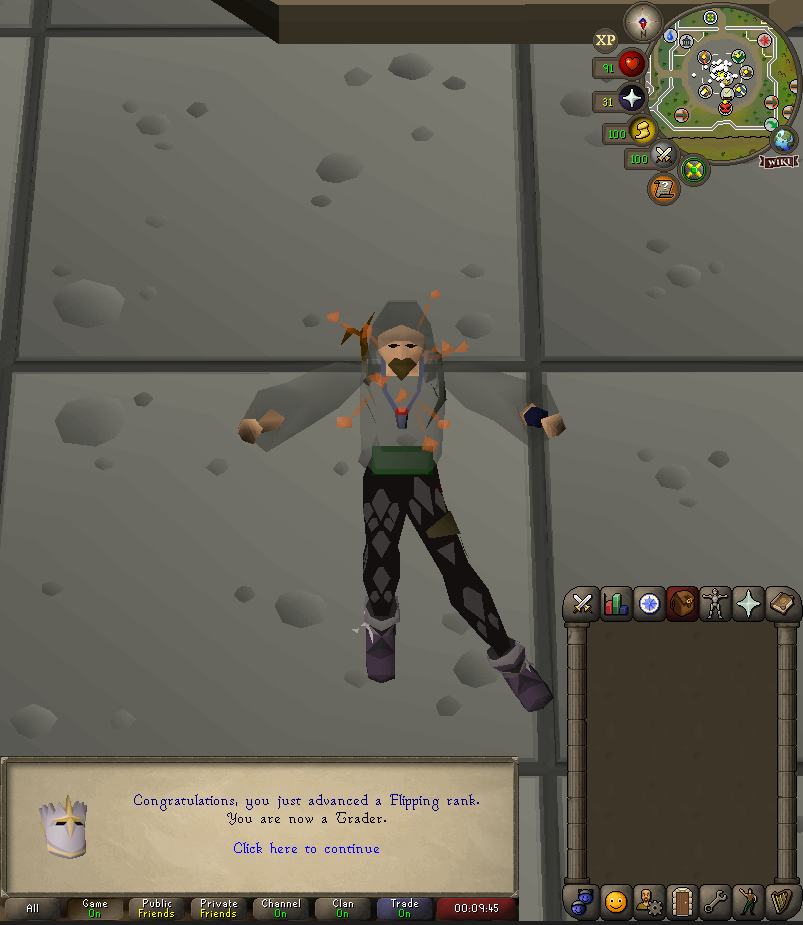

#### Activity panel

Sell and buy price, the last price each side actually traded at, margin, margin × buy limit, ROI,
and how much of your 4-hour buy limit is left with a countdown to the reset.

Search the whole Grand Exchange, not only the items you have already flipped, and sort the list by
completion, profit or ROI.

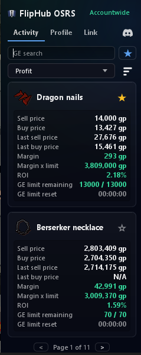

#### You can see how old a price is

A live price is only ever the last trade someone made, and plenty of items go an hour between
trades. So the two live prices are coloured by the age of the trade behind them:

- **white** — traded within the last half hour
- **amber** — nothing for 30 minutes, and going cold
- **red** — nothing for an hour, so don't type it into an offer without checking

Each side is judged on its own. An item that sells briskly but is bought rarely shows one of each,
which is the whole point: it is the stale side that costs you.

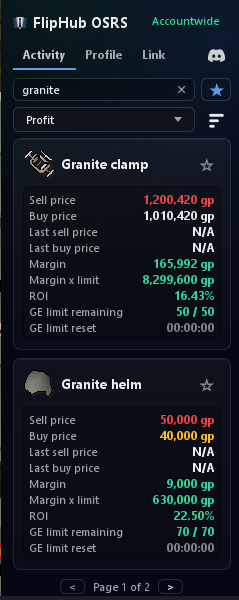

Hover either price for the exact age of both.

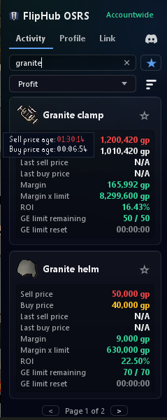

The same three colours run the **offer timers** in game: each Grand Exchange slot carries the time
since that offer last moved — green under five minutes, yellow under thirty, red beyond. Turn them
off with **Show GE offer timers**.

#### Bookmarks

Star the items you flip often and filter the list down to just those. An item you never want to see
again can be hidden from its icon.

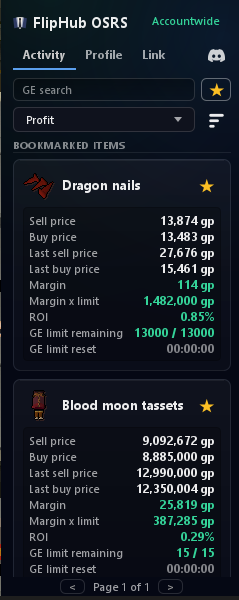

#### Grand Exchange suggestions

Setting up an offer fills the prompts in with the numbers you'd otherwise alt-tab for.

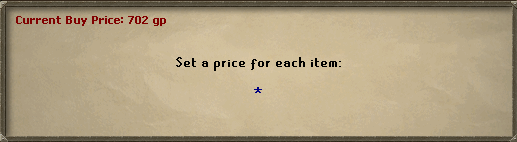

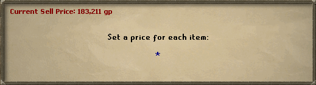

On a buy, the quantity prompt adds your remaining limit and how many you can afford.

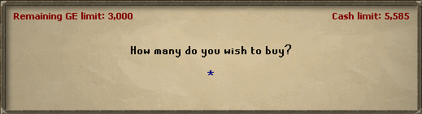

#### Decimal prices

The game reads `9m` in a price box but refuses the decimal point that would let you write `9.4m`.
This adds it, in any *enter an amount* prompt — Grand Exchange price and quantity, bank withdraw-X,
trade, coffers.

- `9.4m` → 9,400,000
- `1.21b` → 1,210,000,000
- `2.5325k` → 2,532 — anything past a whole coin is dropped

Turn it off with **Type decimal amounts** in the plugin settings.

#### Profile

Completed flips totalled per item over **Session**, **Last 1h**, **4h**, **24h**, **7d** or **All
time**. Sort by completion, profit or ROI.

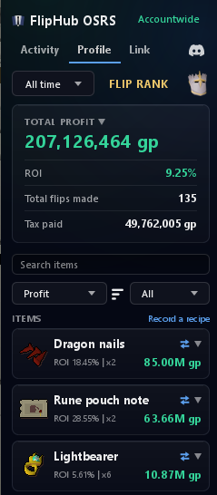

Open an item for what those totals are made of — average buy and sell, quantity, how long a flip
took to fill — and every flip behind them, listed one by one.

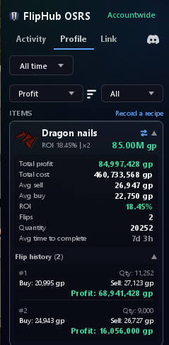

#### Recipes

Bought a blade and a hilt, made a godsword, sold it? The game never tells a plugin that two items
became one, so the three trades would otherwise be counted as three separate flips — one of them
looking like a windfall and the others like losses.

**Record a recipe** on the Profile tab. Your finished trades are listed newest first; tick the ones
the recipe was made from — the purchases that went in and the sales the result went out through.
Assembling, disassembling, repairing and making or breaking sets are all covered.

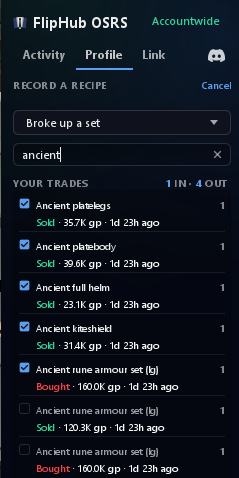

A repair fee counts towards the cost, and the total is worked out in front of you before anything
is written down. Everything you have recorded is listed underneath, and any of it can be undone.

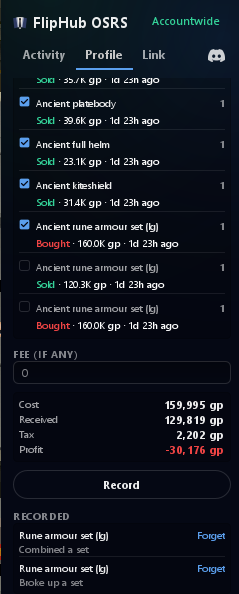

Afterwards the trades are one activity with one profit, filed under the item the recipe was about,
and the Profile tab says which kind each one was.

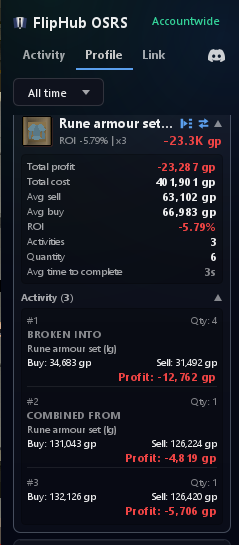

Nothing is guessed and nothing is recorded for you.

#### Sync with FlipHub OSRS

Link your plugin with your FlipHub OSRS account to sync flips and get personalised flip insights to
start flipping smarter.

Synced flips build your **My Statistics** page — the items worth going back to, profit over time,
and ranks as your total climbs.

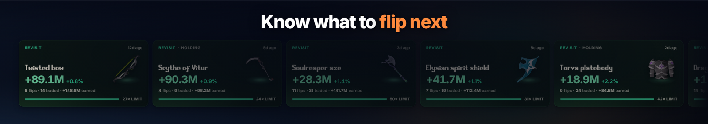

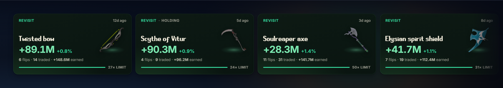

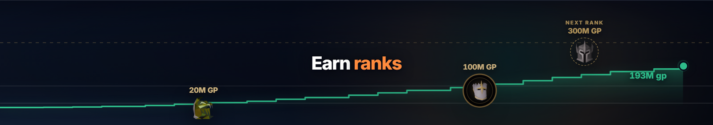

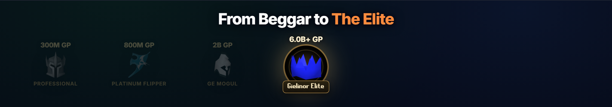

*The screenshots in this section are the FlipHub website, not the plugin.*

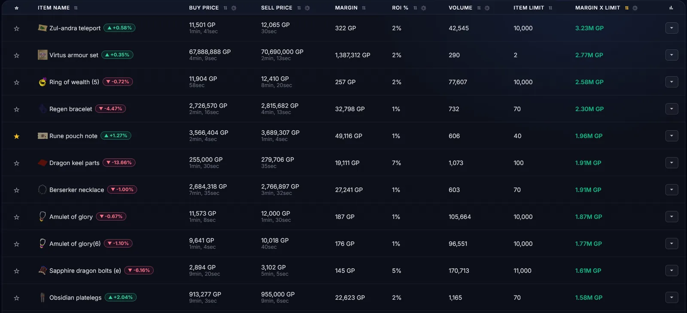

#### Also

- **Offer preview** — open an offer in game and the panel jumps to that item.
- **One character or all of them** — the name above the tabs picks whose trades you are looking at,
  or adds them all together.

## Getting started

Install the plugin and open the FlipHub panel from the sidebar. Offer tracking, buy limits and Wiki
prices work immediately — no account, no setup.

To sync to the dashboard as well, open the **Link** tab in the FlipHub panel, paste your license
key from [osrsfliphub.com/my-statistics](https://www.osrsfliphub.com/my-statistics) and click
**Link account**. The tab shows whether the device is linked; **Unlink this device** stops it —
uploads end immediately and the plugin returns to local-only.

## Privacy

The plugin is local-first. It watches Grand Exchange events the client already exposes and performs
no automation — it never clicks, moves, or trades for you. The only thing it writes into the game is
text in a chatbox prompt you opened yourself: a suggested price when you click one, or the decimal
point you just typed. You still confirm every offer. No RuneScape or Jagex credentials are
requested, read, or transmitted.

- **Without linking (default)** — No trade data leaves your machine. The only network calls are
  read-only price lookups to `prices.runescape.wiki`.
- **With sync enabled and linked** — Your Grand Exchange offer events (item, quantity, price, offer
  state, timestamps) are uploaded over HTTPS to `osrsfliphub.com` to power your dashboard, along
  with any recipes you record (which of those trades went into which, and the fee you entered), so
  the dashboard stops showing the parts as still held. As with any request to a third-party server,
  this exposes your IP address to it.

## Support

[Contact support](https://www.osrsfliphub.com/support).

## License

Released under the [BSD 2-Clause License](LICENSE).
