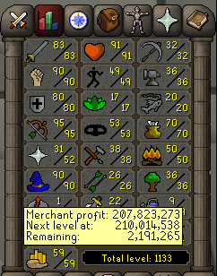
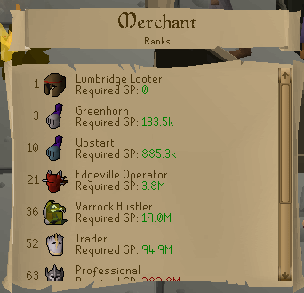
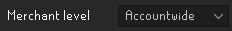
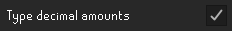
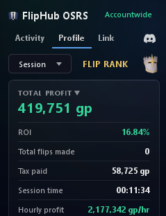
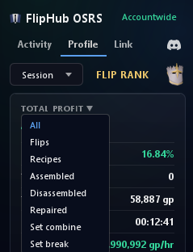
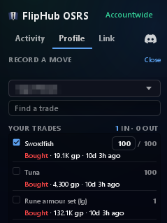
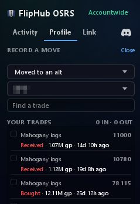
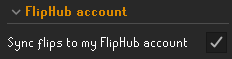

  

# OSRS FlipHub

Track your Grand Exchange flips — margins, buy limits and live Wiki prices, right in the sidebar.

Works entirely offline. Linking a [FlipHub](https://www.osrsfliphub.com) account is optional and
**off by default**.

## New: the Merchant skill

Your flipping is now a skill. Merchant sits in the game's own skills tab, levelled by your lifetime
profit on the same experience curve as every other skill — 99 is 10B. Hover it like any other skill
for your profit and what the next level takes. [More about Merchant](#merchant-skill)

## Contents

- [Features](#features)
  - [Merchant skill](#merchant-skill)
  - [Activity panel](#activity-panel)
  - [You can see how old a price is](#you-can-see-how-old-a-price-is)
  - [Bookmarks](#bookmarks)
  - [Grand Exchange suggestions](#grand-exchange-suggestions)
  - [Decimal prices](#decimal-prices)
  - [Profile](#profile)
  - [Recipes](#recipes)
  - [Moving stock between your accounts](#moving-stock-between-your-accounts)
  - [Trades made while the plugin was off](#trades-made-while-the-plugin-was-off)
  - [Sync with FlipHub OSRS](#sync-with-fliphub-osrs)
  - [Also](#also) — offer preview, characters, several clients, managing your data
- [Getting started](#getting-started)
- [Privacy](#privacy)
- [Support](#support)
- [License](#license)

## Features

#### Merchant skill

Merchant sits in the game's own skills tab as a twenty-fifth skill, on a row of its own with the
Total level beside it. Its level is your lifetime profit read on the game's own experience curve:
level 99 is 10B profit, and level 92 is 5B because 92 is halfway to 99 in experience. Past 99 it
carries on in prestige tiers, the first at 15B and each costing a quarter more than the last, with
the tier struck into the icon as a Roman numeral.

Hovering reads like any other skill (past 99 it shows your prestige and the next tier), and
clicking opens a guide to FlipHub's ten ranks, from
Lumbridge Looter to Gielinor Elite: the level each starts at and the profit it takes, green once
you have earned it and red until then.

Untick **Show Merchant in the skills tab** in the plugin's settings and the tab goes straight back
to the game's own twenty-four.

The ranks are bands of those levels. **FLIP RANK** on the Profile tab shows where you stand, in
your rank's colour, and hovering it names the next rank and the level it starts at.

When a sale earns a level, the game congratulates you the way it does for a skill: the message in
the chatbox, the level-up fireworks and a dance. A level that starts a new rank names the rank in
your chat as well, and until you go and look, the Skills tab flashes and the Merchant square
glows. Only you see any of it.

Turn the celebration off with **Celebrate level-ups**.

By default Merchant counts every character's profit added together. Set **Merchant level** to
**Per character** and each character is levelled on its own profit instead, with its own level-ups.

#### Activity panel

The live sell and buy price, the last price you yourself sold and bought the item at, the margin
after GE tax, that margin times what is left of your buy limit, ROI, and how much of your 4-hour
buy limit is left with a countdown to the reset.

Search the whole Grand Exchange, not only the items you have already flipped, and sort the list by
completion, profit or ROI, either way round. Click an item's name to open it on osrsfliphub.com.

#### You can see how old a price is

A live price is only ever the last trade someone made, and plenty of items go an hour between
trades. So the two live prices are coloured by the age of the trade behind them:

- **white** — traded within the last half hour
- **amber** — nothing for 30 minutes, and going cold
- **red** — nothing for an hour, so don't type it into an offer without checking

Each side is judged on its own. An item that sells briskly but is bought rarely shows one of each,
which is the whole point: it is the stale side that costs you.

Hover either price for the exact age of both.

Your own offers get the same treatment in game. Each Grand Exchange slot carries an **offer
timer**: the time since that offer last moved, in green under five minutes, yellow under thirty and
red beyond. Turn them off with **Show GE offer timers**.

#### Bookmarks

Star the items you flip often and filter the list down to just those. An item you never want to see
again can be hidden from its icon.

#### Grand Exchange suggestions

Setting up an offer puts the numbers you'd otherwise alt-tab for above the prompt. Click one to
type it in.

On a buy, the quantity prompt adds your remaining limit and how many the coins in your inventory
buy at the price you entered.

#### Decimal prices

The game reads `9m` in a price box but refuses the decimal point that would let you write `9.4m`.
This adds it, in any *enter an amount* prompt — Grand Exchange price and quantity, bank withdraw-X,
trade, coffers.

- `9.4m` → 9,400,000
- `1.21b` → 1,210,000,000
- `2.5325k` → 2,532 — anything past a whole coin is dropped

Turn it off with **Type decimal amounts** in the plugin settings.

#### Profile

Completed flips totalled per item over **Session**, **Last 1h**, **Last 4h**, **Last 24h**, **Last
7d** or **All time**. Sort by completion, profit or ROI, either way round.

On **Session** it also shows how long you have been playing and your profit per hour.

Click **Total Profit ▼** to count one kind of activity only (flips, recipes, or one kind of
recipe), and the **All** dropdown beside the sort narrows the list the same way.

Open an item for what those totals are made of — average buy and sell, quantity, how long a flip
took to fill — and every flip behind them, listed one by one.

#### Recipes

Bought a blade and a hilt, made a godsword, sold it? The game never tells a plugin that two items
became one, so the three trades would otherwise be counted as three separate flips — one of them
looking like a windfall and the others like losses.

**Record a recipe** on the Profile tab. Your finished trades are listed newest first; tick the ones
the recipe was made from — the purchases that went in and the sales the result went out through.
Assembling, disassembling, repairing and making or breaking sets are all covered.

Anything the recipe itself cost you, such as a repair fee, goes in **Fee (if any)** and counts
towards the cost, and the total is worked out in front of you before anything is written down. Everything you have recorded is listed underneath, and any of it can be undone.

For a Barrows or Moons of Peril repair the fee fills itself in when you tick the broken piece. It
is what a player-owned house armour stand charges at your Smithing level: half a percent off the
NPC price per level, so 45,450 gp for a Dharok's platebody at 99 where the NPC asks 90,000. If you
pay an NPC, untick **I repair on an armour stand** in the plugin's settings and it fills in the
full price instead. Either way, type over it and your number stays.

Afterwards the trades are one activity with one profit, filed under the item the recipe was about,
and the Profile tab says which kind each one was.

Nothing is guessed and nothing is recorded for you.

#### Moving stock between your accounts

Bought on your main, sold on an alt? Each account keeps its own books, so the items would sit on
the main as unsold for ever while the alt's sales showed no profit at all.

On the account that bought them, click **Move** beside Record a recipe on the Profile tab. Tick the
purchases — or type how many of one — pick the account they went to, and press **Record
Transfer**. You tick no sales.

The items move onto that account's books at what you paid, and every sale it makes of them is an
ordinary flip at that price, whether it sold them before you recorded the move or after. On that
account they come first on the same screen, marked **Received**, so they can be moved on again or
used in a recipe.

To undo a move, click **Forget** beside it on the account that recorded it. An account has to have
logged in with the plugin on this computer to appear in the list.

#### Trades made while the plugin was off

Traded on mobile, or with the plugin turned off? Open the Grand Exchange **History** tab once after
you log in. The plugin waits for the list to finish loading, adds the finished trades it missed,
and says in your chat how many. The first time, it only notes where your history stands and adds
nothing. The tab only holds your latest trades, so if you have made more than it shows since last
time, nothing is added and the chat tells you. Trades picked up this way never set off a level-up.

#### Sync with FlipHub OSRS

Link your plugin with your FlipHub OSRS account to sync flips and get personalised flip insights to
start flipping smarter.

Linking ticks **Sync flips to my FlipHub account** in the plugin's settings for you. Untick it to
pause uploads without unlinking.

The trades already on this computer go up too, for each of your characters, so the dashboard
starts complete. While you are linked the name above the tabs is green; hover it to see how
uploads are going.

Synced flips build your **My Statistics** page — the items worth going back to, profit over time,
and ranks as your total climbs.

*The screenshots in this section are the FlipHub website, not the plugin.*

#### Also

- **Offer preview** — while you set up or check an offer in game, the Activity list shows just that
  item.
- **One character or all of them** — the name above the tabs picks whose trades you are looking at,
  or adds them all together. It follows whoever is logged in until you pick one yourself.
- **Two clients, one set of books** — run several clients on this computer and each sees the
  others' trades as they happen.
- **Manage data** — in the same name menu. Wipe one character's history, every character's, or
  (when linked) your statistics on the website. Each wipe asks you to type a confirmation first.
- **Discord** — the icon beside the tabs opens the FlipHub Discord.

## Getting started

Install the plugin and open the FlipHub panel from the sidebar. Offer tracking, buy limits and Wiki
prices work immediately — no account, no setup.

To sync to the dashboard as well, open the **Link** tab in the FlipHub panel, paste your license
key from [osrsfliphub.com/my-statistics](https://www.osrsfliphub.com/my-statistics) and click
**Link account** while you are logged in to the game. The tab shows whether the device is linked; **Unlink this device** stops it —
uploads end immediately and the plugin returns to local-only.

## Privacy

The plugin is local-first. It watches Grand Exchange events the client already exposes and performs
no automation — it never clicks, moves, or trades for you. The only thing it writes into the game is
text in a chatbox prompt you opened yourself: a suggested price or quantity when you click one, or
an amount like `9.4m` turned into whole coins when you press Enter. You still confirm every offer.
Everything else it adds in game — the Merchant row and its guide, the level-up message, fireworks
and dance, the offer timers and its chat messages — is drawn on your screen only. No RuneScape or
Jagex credentials are requested, read, or transmitted.

- **Without linking (default)** — No trade data leaves your machine. The only network calls are
  read-only price lookups to `prices.runescape.wiki`.
- **With sync enabled and linked** — Your Grand Exchange offer events (item, quantity, price, offer
  state, timestamps, and the world you traded on) are uploaded over HTTPS to `osrsfliphub.com` to
  power your dashboard. That includes the trades already stored on this computer for any of your
  characters (up to 16) the website does not have yet, and trades picked up from the GE History
  tab. Linking also sends a random device ID the plugin makes up and the plugin's version, and
  while you stay linked a summary of your account-wide totals per item is sent from time to time.
  Also sent: any recipes you record (which of those trades went into which, and the fee you entered), so
  the dashboard stops showing the parts as still held, and any purchases you record as moved to
  another of your accounts (which purchases, how many, and that account's fixed code), so the
  dashboard counts them where they were sold. Each event carries a fixed code for the
  character that made the trade, so one character's sale is never matched with another's purchase.
  The code is not your character's name, but it is worked out from your account's ID or, failing
  that, from the name, so someone who already knew the name could match the two. As with any
  request to a third-party server, this exposes your IP address to it.

## Support

[Contact support](https://www.osrsfliphub.com/support).

## License

Released under the [BSD 2-Clause License](LICENSE).
